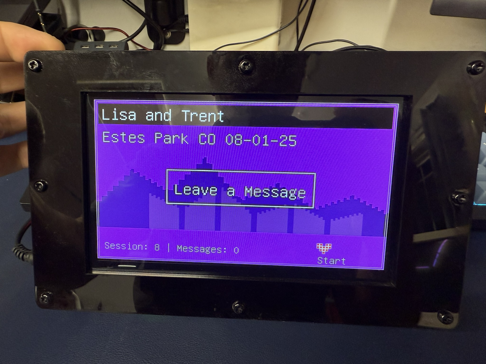
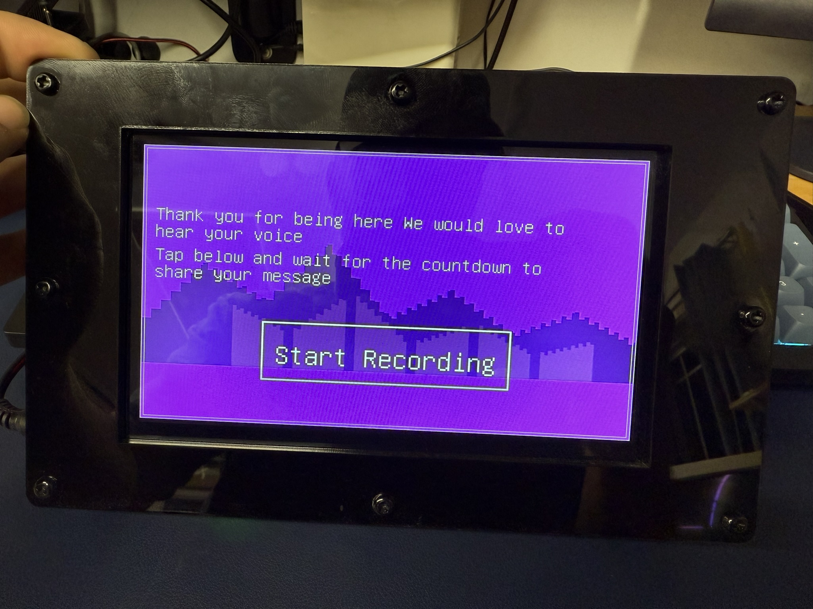
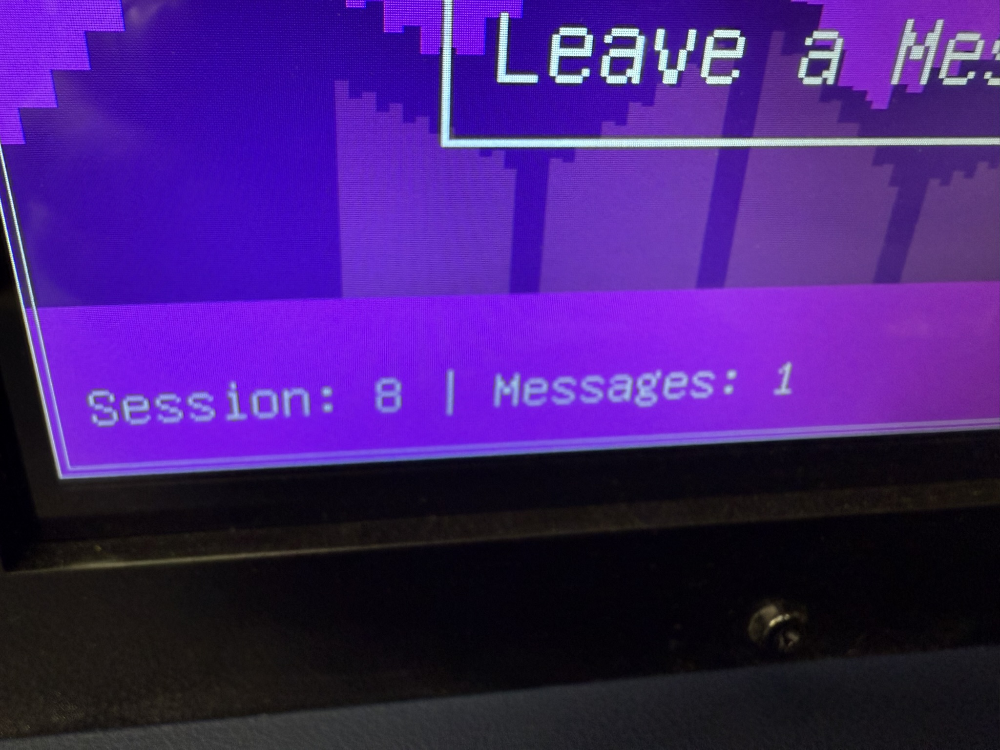
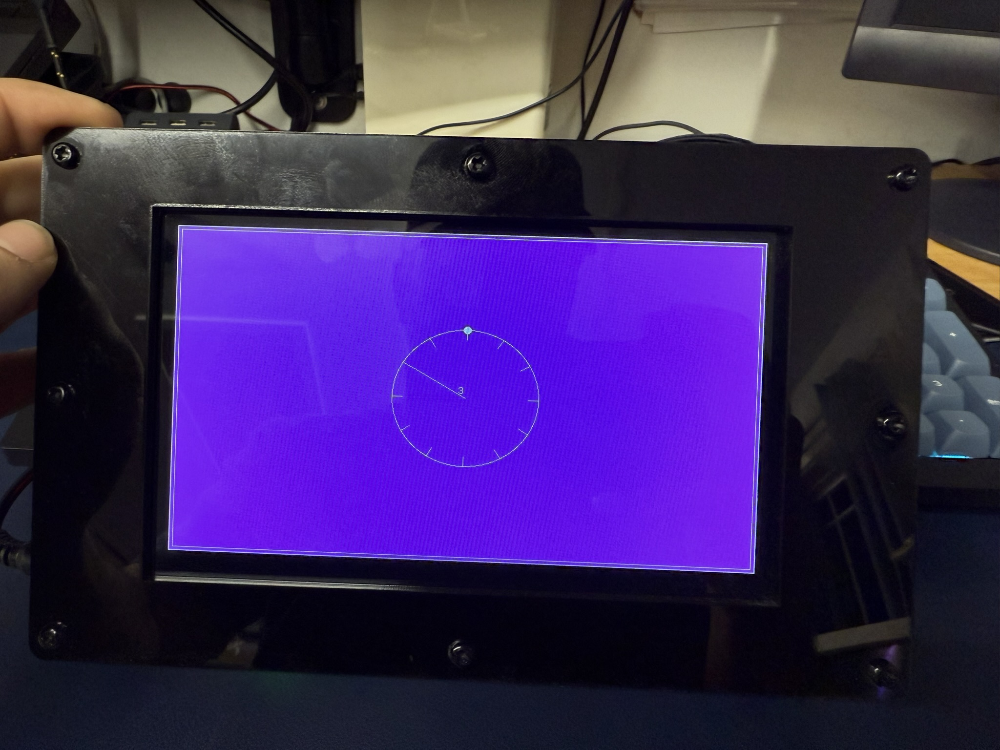
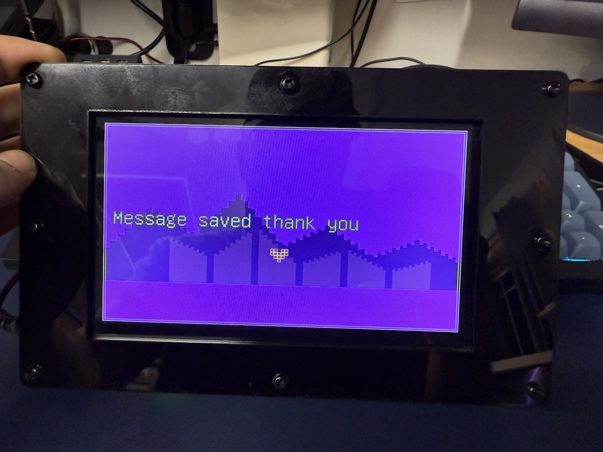
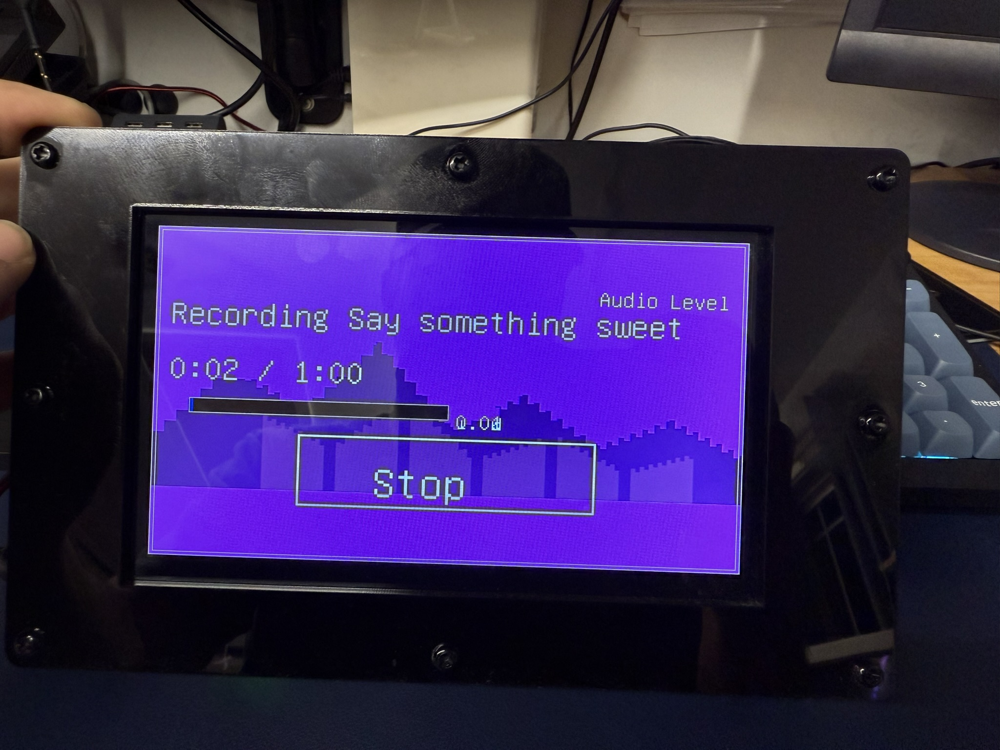

# Leave a Message Arduino Project

An interactive Arduino project that allows users to leave and display messages on a touchscreen interface. Record audio messages that can be played back later!

## Overview

This project implements a message board functionality using an Arduino-compatible microcontroller. Users can leave audio messages that are stored and played back according to programmed criteria.

### Project Screens

| Recording Interface | Sessions Screen |
|:------------------:|:---------------:|
|  |  |

| Countdown Screen | Message Saved |
|:----------------:|:-------------:|
|  |  |

## Hardware Requirements

- Arduino-compatible microcontroller with audio capabilities (Teensy recommended)
- RA8875 TFT display (800x480 resolution)
- SGTL5000 audio codec for recording and playback
- SD card module for message storage
- Microphone for audio input
- Speaker/headphone output for playback
- Touch interface for user interaction

## Features

- Audio message recording and playback
- Message storage and session management
- Touch-based user interface
- Audio level monitoring for optimal recording
- Countdown timer for recording duration
- Multiple message storage

## Session Management

The project implements an intelligent session management system designed for long-term installations and power cycles:

- **Automatic Session Creation**: Each time the device powers on, it automatically creates a new session folder for storing messages, or continues an existing session if it's nearly empty.

- **Power Cycle Handling**: When power is lost and restored, the system creates new session folders to ensure no message data is overwritten or corrupted.

- **Folder Structure**: Messages are organized in numbered folders (e.g., `/messages`, `/messages2`, `/messages3`), with each new power cycle potentially creating a new session folder.

- **Session Continuity**: If a previous session folder contains fewer than 3 messages, the system will continue using it rather than creating a new folder. This prevents having many nearly-empty session folders.

- **Message Preservation**: The session system ensures that even in environments with frequent power interruptions, all recorded messages are preserved and properly organized.

## Installation

1. Connect the hardware components according to the pin definitions in the code
2. Upload the `Leave_a_message.ino` sketch to your Arduino-compatible board
3. Follow the on-screen instructions to interact with the system

## Usage

The system allows users to:
- Record new audio messages (up to 60 seconds per message)
- Browse and play back previously recorded messages
- Navigate through multiple recording sessions
- Monitor audio levels during recording
- View recording countdown timer

## Technical Details

### Recording Process
1. The system captures audio at 44.1kHz with 16-bit resolution (CD quality)
2. Audio is buffered through the SGTL5000 codec and saved to SD card
3. WAV files are created with proper headers for universal compatibility
4. Audio level monitoring provides visual feedback during recording
5. Each message is timestamped with a unique identifier

### File Format
- Standard WAV files (uncompressed PCM audio)
- 44.1kHz sample rate, 16-bit depth, mono channel
- Compatible with any audio player or software
- Files are named using a timestamp format: `msg_MMDD_HHMM_X.wav`

### Power Management
- The system is designed to handle power interruptions gracefully
- No data loss occurs when power is cut unexpectedly
- Sessions are managed to organize recordings across power cycles
- SD card writes are properly finalized to prevent data corruption

## License

This project is open source and available for educational and recreational purposes.

## Author

Created by VonHoltenCodes.